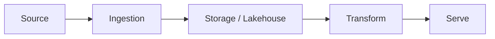

<!--
  This README is the STANDARD. Keep the section order identical across every project.
  Replace bracketed placeholders. Delete this comment.
-->

# [Project Name]

> One sentence: what this does and why it matters. Written for a recruiter skimming in 8 seconds.

[](https://github.com/USER/REPO/actions/workflows/ci.yml)


**Live demo:** [link] · **Write-up:** [blog/LinkedIn link] · **Demo GIF below.**


## Why this exists

2–3 sentences. The problem, and what a senior engineer would care about here
(scale, cost, correctness, observability). Part of the **Meridian** marketplace platform.

## Architecture



Key decisions are recorded in [`docs/adr/`](docs/adr/). Read those to understand the *why*.

## Stack

| Layer | Tool | Why |
|------|------|-----|
| | | |

## Quickstart

```bash
make setup     # uv venv + install + pre-commit
make test      # run tests
make run       # run the thing
```

## What I learned

The honest version: what was hard, what I'd do differently at 10x scale, the tradeoff
I made and why. This section is what separates a portfolio from a tutorial.

## Roadmap / status

- [ ] ...

---
Part of a modern data + AI platform portfolio. See the [profile hub](https://github.com/USER) for the full story.
