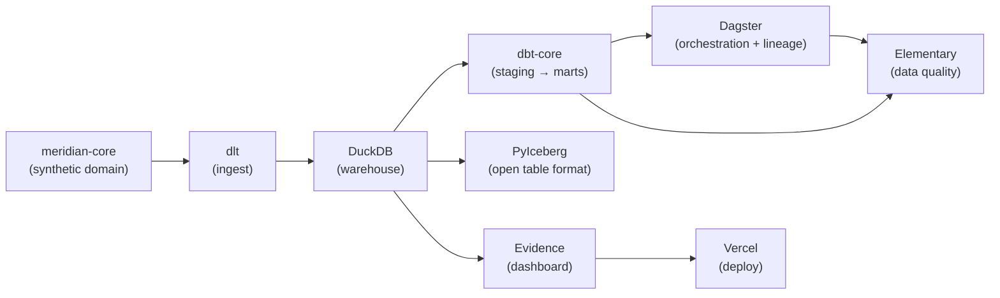

# Meridian Batch Data Platform

> End-to-end modern data stack on a laptop: dlt ingestion → DuckDB warehouse → dbt transforms → Dagster orchestration → Evidence dashboard — with Iceberg as an open-format taste track.

[](https://github.com/AndreFelippeVidal/meridian-batch-platform/actions/workflows/ci.yml)


**Live demo:** [meridian-batch.vercel.app](https://meridian-batch.vercel.app) · **Write-up:** [LinkedIn](#) · **Demo GIF below.**


## Why this exists

Building a data platform usually means stitching together 6–8 tools with no single example showing how they fit end-to-end — ingestion, warehouse, transformation, orchestration, quality, and serving all wired together and tested. This project does exactly that with a synthetic marketplace domain (500 customers, 200 products, 2 000 orders), so every layer is real code rather than a toy script. A senior engineer would care about the idempotency contract on ingest, the `threads: 1` DuckDB concurrency constraint that Elementary exposes, and the fact that the full lineage is observable in Dagster before a single line of the dashboard is written.

Part of the **Meridian** marketplace data + AI platform portfolio.

## Architecture



Key decisions are recorded in [`docs/adr/`](docs/adr/). Read those to understand the *why*.

## Stack

| Layer | Tool | Why |
|-------|------|-----|
| Domain | [meridian-core](https://github.com/AndreFelippeVidal/meridian-core) v0.2.0 | Shared synthetic domain — versioned, never vendored |
| Ingestion | dlt 1.4+ | Declarative resources, merge/replace dispositions, schema inference |
| Warehouse | DuckDB 1.0+ | Zero-setup analytical DB; Snowflake stub in `profiles.yml` |
| Transform | dbt-core + dbt-duckdb 1.9+ | Staging views → mart tables; generic + singular tests |
| Orchestration | Dagster 1.9+ | Software-defined assets; full dlt → staging → marts lineage |
| Data quality | Elementary 0.16+ | On-run hooks + `edr report` HTML; bad-row roundtrip test |
| Open format | PyIceberg 0.9+ | Local Parquet + SQLite catalog; schema evolution + time-travel |
| Serving | Evidence (npm) | SQL-in-Markdown dashboards; static build deployable to Vercel |
| Deploy | Vercel | Zero-config static hosting; one-command redeploy |
| Tooling | uv · ruff · mypy · pytest · pre-commit + gitleaks | Production discipline on a portfolio project |

## Quickstart

```bash
# 1. Install Python deps
make setup

# 2. Load synthetic raw data into DuckDB
make ingest

# 3. Build dbt staging + mart models (runs all tests)
make transform

# 4. Launch the Dagster UI — open http://localhost:3000
make dagster-dev

# 5. Generate the Elementary data quality report
make edr-report        # → transform/edr_target/elementary_report.html

# 6. Write Iceberg tables + run the time-travel demo
make ingest-iceberg    # run twice to get ≥ 2 snapshots
make iceberg-demo

# 7. Build and preview the Evidence dashboard
make evidence-sources  # pull DuckDB data → source parquet files
make evidence-build    # → serving/build/
```

Run the full test suite (25 tests):
```bash
make test
```

## Project layout

```
ingestion/          dlt source + pipeline; Iceberg pipeline + demo
orchestration/      Dagster definitions, assets (ingest / transform / quality)
transform/          dbt project (staging views → mart tables + Elementary)
serving/            Evidence dashboard (4 pages) → Vercel
tests/              25 pytest tests across all layers
docs/adr/           6 Architecture Decision Records
data/               DuckDB file + Iceberg warehouse (gitignored, regenerated by make)
```

## What I learned

**The DuckDB single-writer constraint is real and surfaces late.** Elementary's incremental
models try to run concurrently; DuckDB silently queues and then throws a lock error if you
have `threads > 1`. The fix is one line in `profiles.yml`, but finding it required reading
Elementary's internals. At 10× scale I'd move to a multi-writer warehouse (Snowflake,
BigQuery) — the Snowflake stub in `profiles.yml` is the swap point.

**`from __future__ import annotations` breaks Dagster.** PEP 563 defers annotation
evaluation by stringifying type hints. Dagster's asset decorator does a runtime
`isinstance` check on `AssetExecutionContext` that fails when the hint is a string rather
than the actual class. I'd never hit this outside a framework that uses runtime type
inspection. The rule is now in the project's ADR.

**dlt's merge disposition is deceptively powerful.** The idempotency test (`make ingest`
twice → zero new rows) passes because dlt tracks cursors per resource in its pipeline
state. That state lives in `.dlt/` and must be gitignored but preserved across runs — easy
to forget in a containerised environment.

**Evidence's source model separates build-time from serve-time.** `npm run sources` runs
SQL against DuckDB and caches the results as Parquet. The static build reads those files —
no live DB connection at serve time. This is elegant for a portfolio demo (deploy once,
data is frozen) but means you must re-run sources after every `make transform`.

## Roadmap / status

- [x] Phase A — meridian-core v0.2.0 (5 generators, referential integrity)
- [x] Phase B — dlt ingestion (merge + replace, idempotency test)
- [x] Phase C — Dagster orchestration skeleton (dlt assets, UI)
- [x] Phase D — dbt transforms (6 staging + 7 mart models, 89 tests)
- [x] Phase E — dbt wired into Dagster (full lineage, asset checks, materialize_all job)
- [x] Phase F — Elementary data quality (edr report, bad-row roundtrip test)
- [x] Phase G — Iceberg taste (schema evolution, time-travel, DuckDB scan)
- [x] Phase H — Evidence dashboard (4 pages, Vercel deploy)
- [ ] Phase I — Vercel live URL, final CI, LinkedIn post

---
Part of a modern data + AI platform portfolio. See the [profile hub](https://github.com/AndreFelippeVidal) for the full story.
